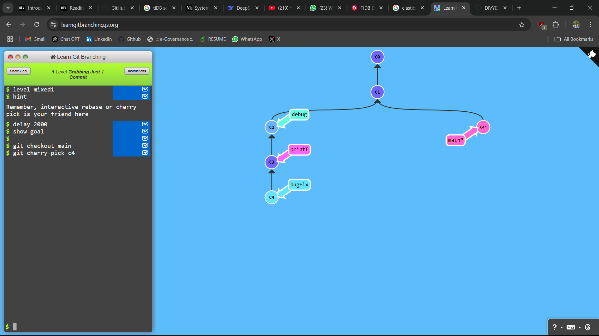
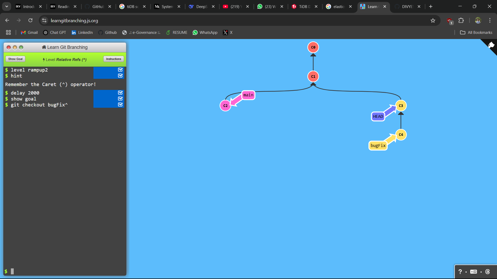

## LEVEL - 1: Grabbing Just 1 Commit

### commands used

```
git checkout main
git cherry-pick c4
```

### Screenshot



## LEVEL - 2: Juggling Commits

### commands used

```
git checkout bugFix^
```

### Screenshot


