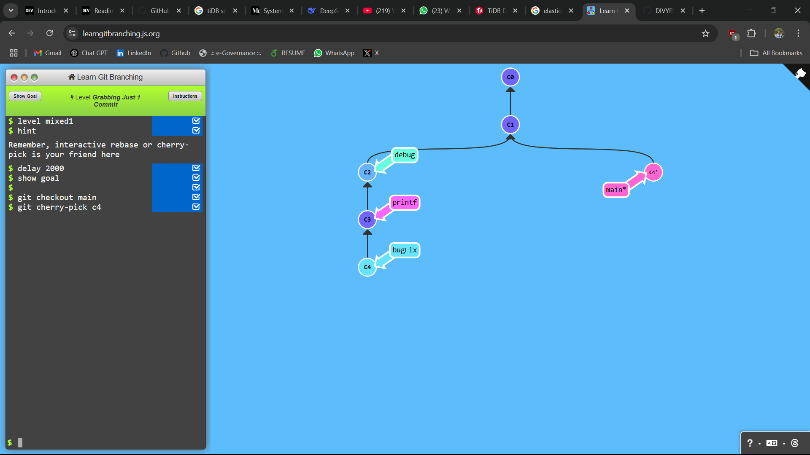
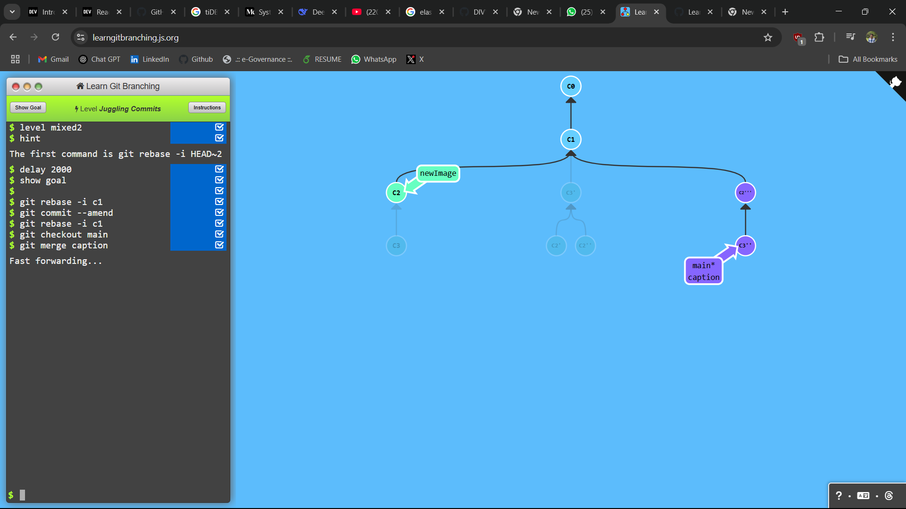
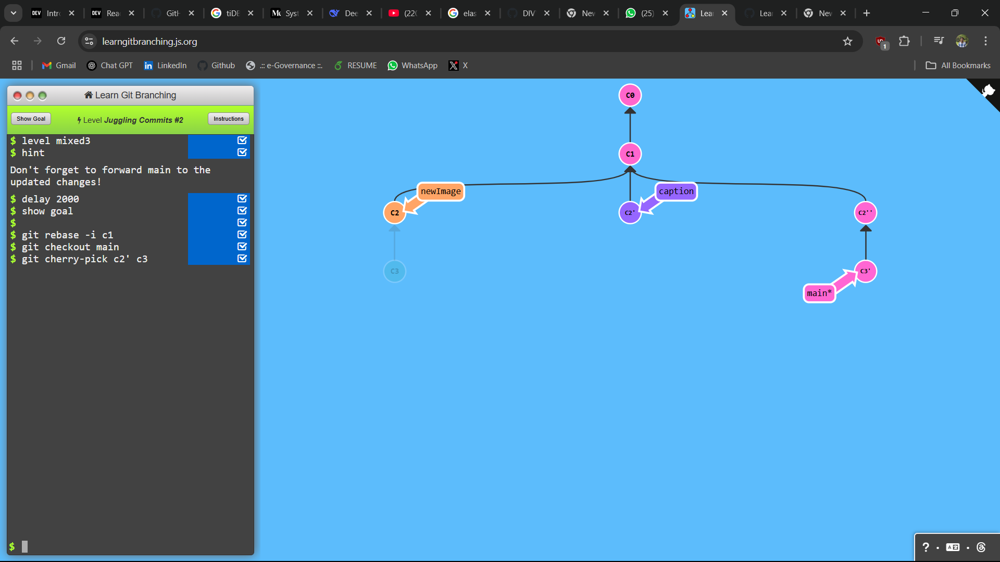
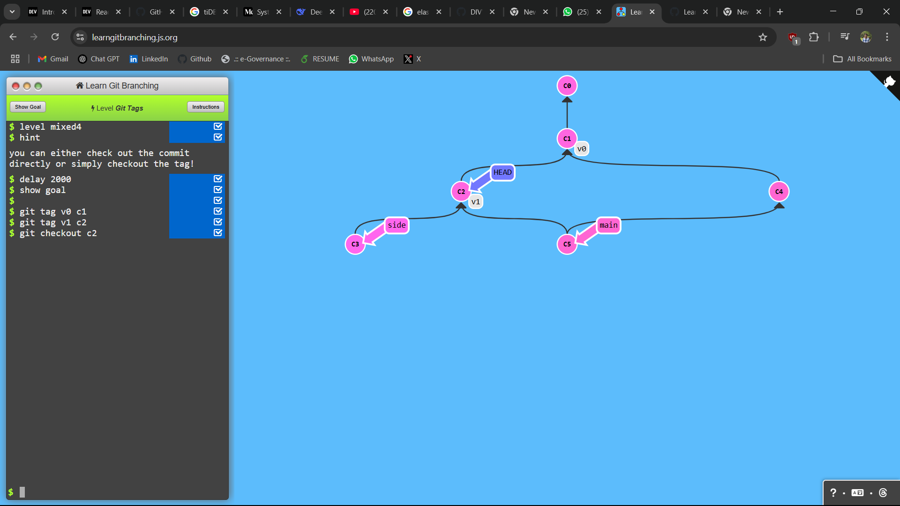
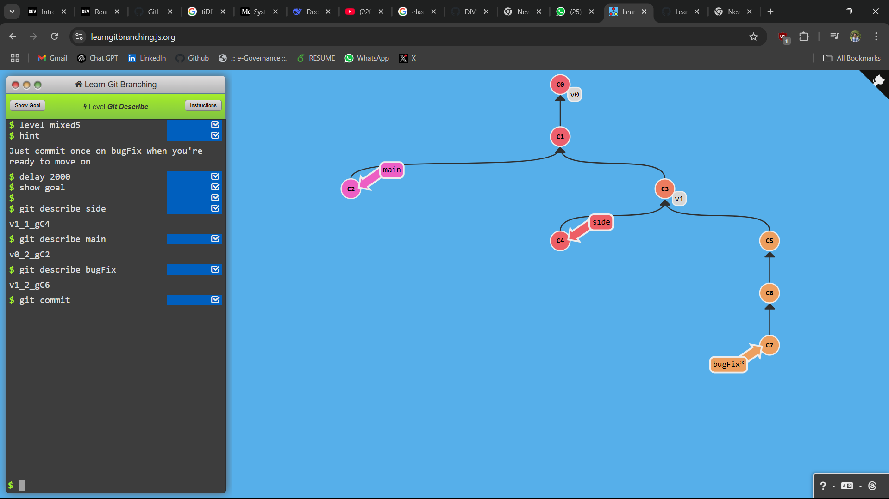

## LEVEL - 1: Grabbing Just 1 Commit

### commands used

```
git checkout main
git cherry-pick c4
```

### Screenshot



## LEVEL - 2: Juggling Commits

### commands used

```
git rebase -i c1
git commit --amend
git rebase -i c1
git checkout main
git merge main
```

### Screenshot



## LEVEL - 3: Juggling Commits #2

### commands used

```
git rebase -i c1
git checkout main
git cherry-pick c2' c3
```

### Screenshot



## LEVEL - 4: Git tags

### commands used

```
git tag v0 c1
git tag v1 c2
git checkout c2
```

### Screenshot



## LEVEL - 5: Git describe

### commands used

```
git describe side
git describe main
git describe bugFix
git commit
```

### Screenshot


