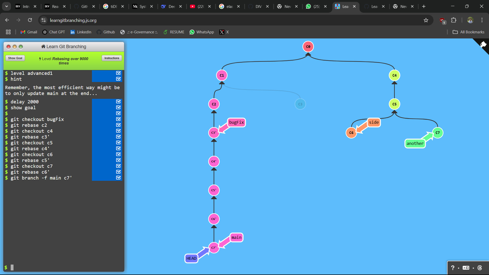
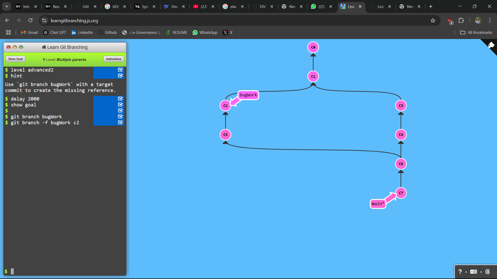
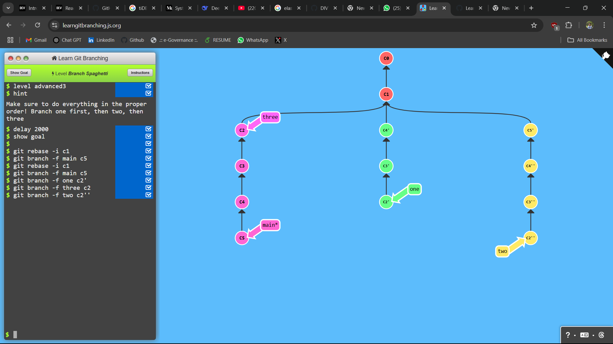

## LEVEL - 1: Rebasing over 9000 times

### commands used

```
git checkout bugFix
git rebase c2
git checkout c4
git rebase c3'
git checkout c5
git rebase c4'
git checkout c6
git rebase c5'
git checkout c7
git rebase c6'
git branch -f main c7'
```

### Screenshot



## LEVEL - 2: Multiple parents

### commands used

```
git branch bugWork
git branch -f bugWork c2
```

### Screenshot



## LEVEL - 3: Branch Spaghetti

### commands used

```
git rebase -i c1
git branch -f main c5
git rebase -i c1
git branch -f main c5
git branch -f one c2'
git branch -f three c2
git branch -f two c2''
```

### Screenshot


