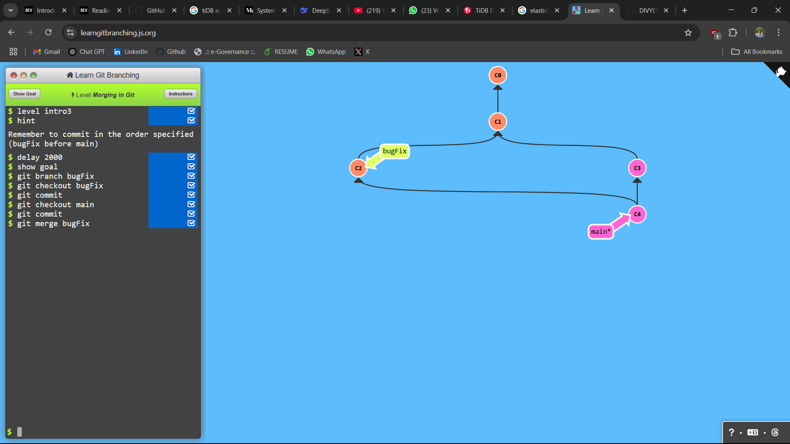
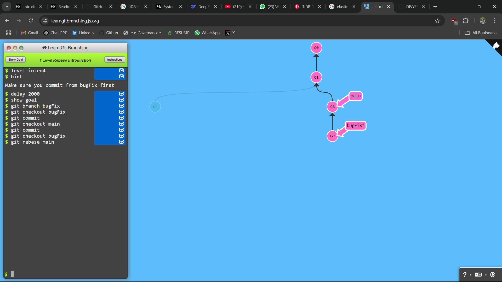

## LEVEL - 1: Introduction to Git Commits

### commands used

```
git commit
```

### Screenshot


## LEVEL - 2: Branching in Git

### commands used

```
git branch bugFix
git checkout bugFix
```

### Screenshot


## LEVEL - 3: Merging in git

### commands used

```
git branch bugFix
git checkout bugFix
git commit
git checkout main
git commit
git merge bugFix
```

### Screenshot



## LEVEL - 4: Rebase Introduction

### commands used

```
git branch bugFix
git checkout bugFix
git commit
git checkout main
git commit
git checkout bugFix
git rebase main
```

### Screenshot


