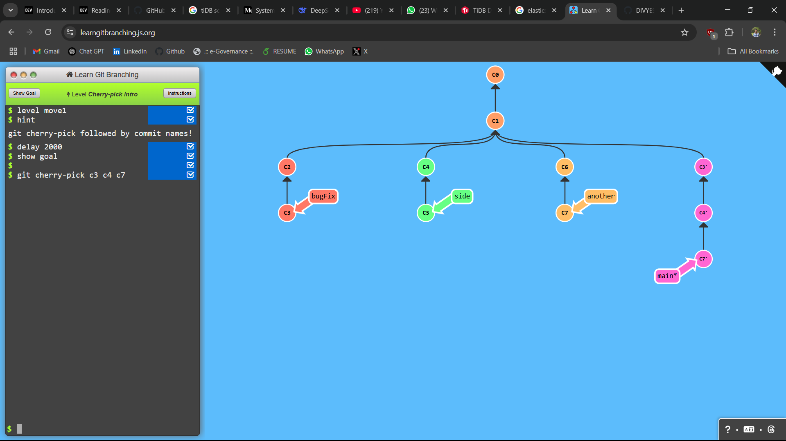
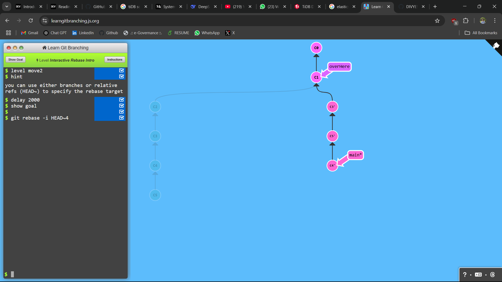

## LEVEL - 1: Cherry-pick Intro

### commands used

```
git checkout c3 c4 c7
```

### Screenshot



## LEVEL - 2: Interactive Rebase Intro

### commands used

```
git rebase -i HEAD~4
```

### Screenshot


