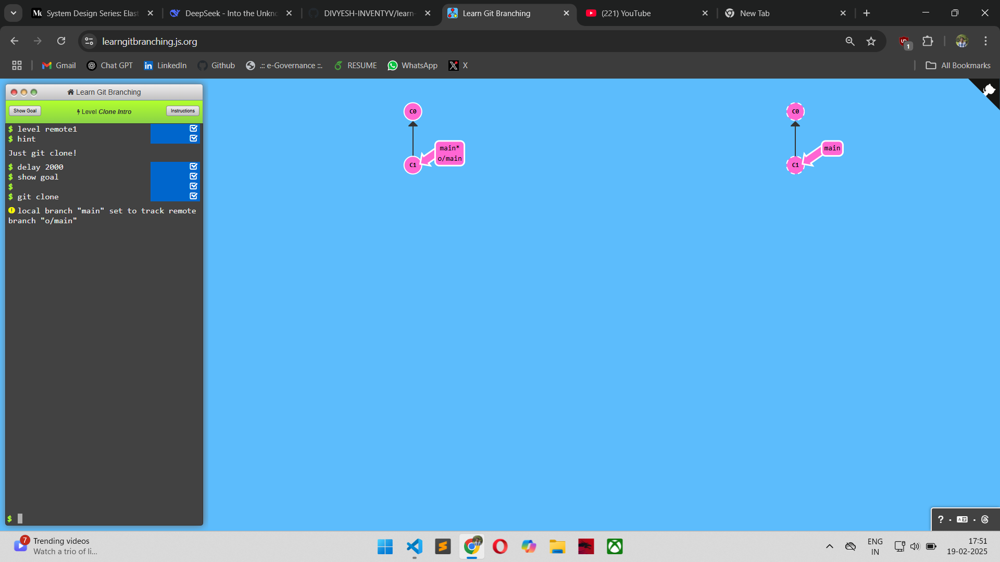
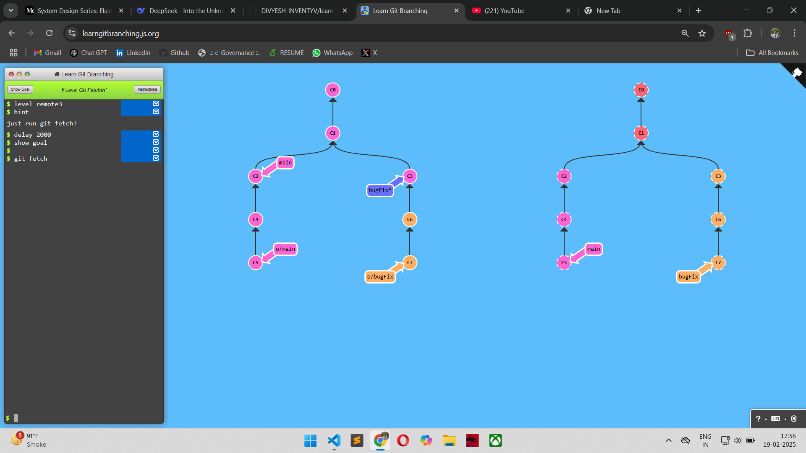
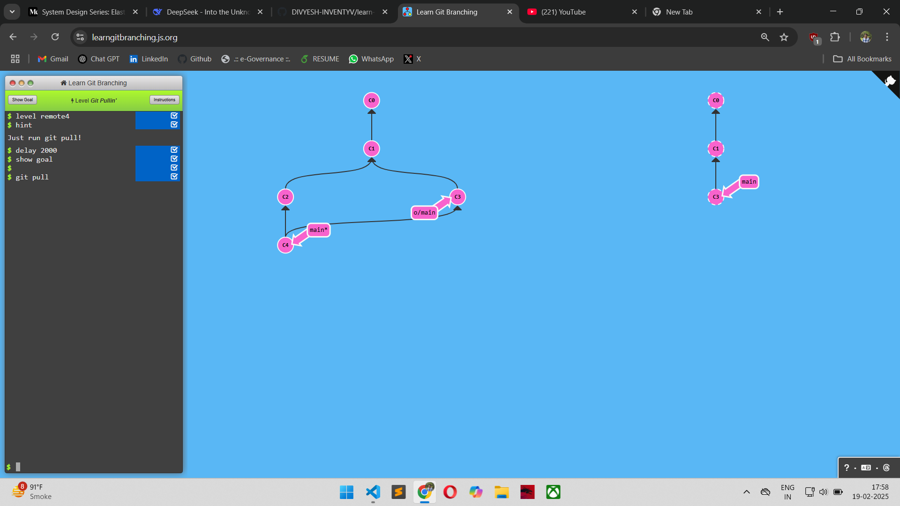
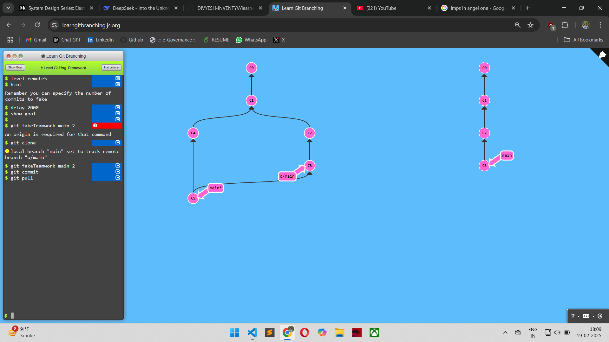
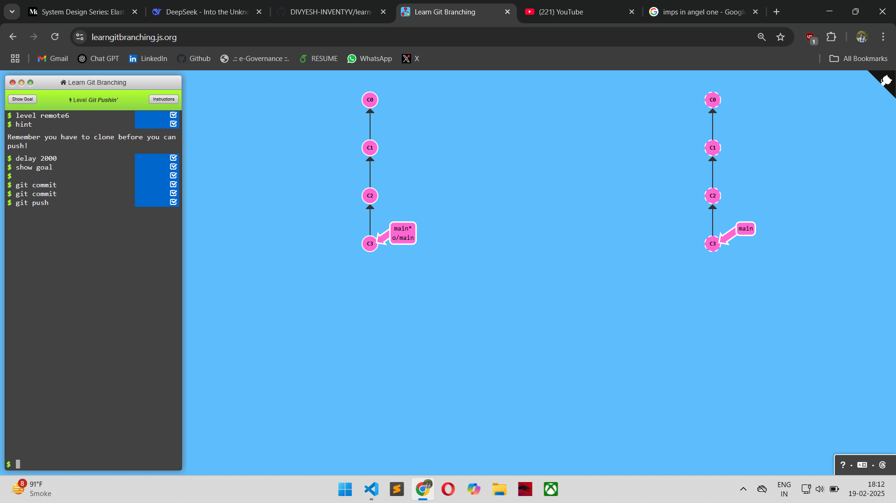
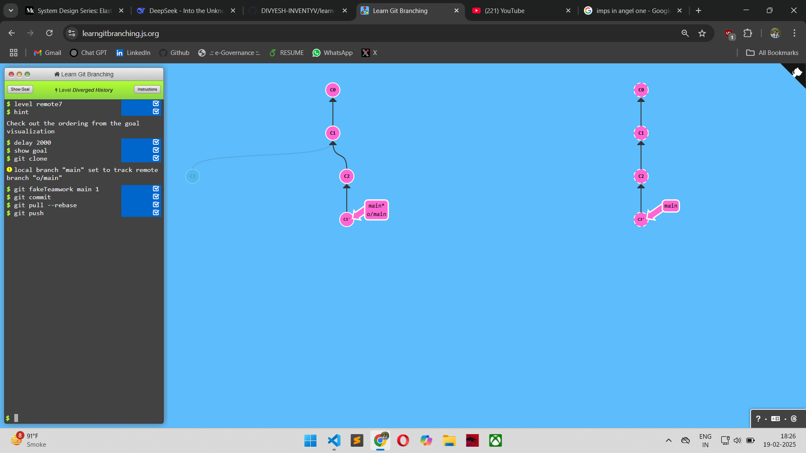
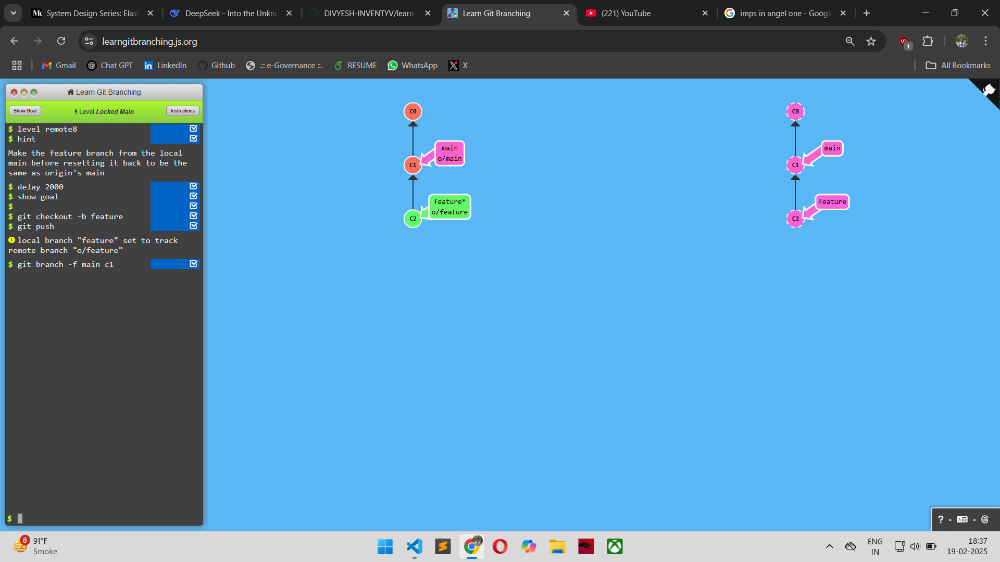

## LEVEL - 1: Clone intro

### commands used

```
git clone
```

### Screenshot



## LEVEL - 2: Remote Branches

### commands used

```
git commit
git checkout o/main
git commit
```

### Screenshot


## LEVEL - 3: Git Fetchin'

### commands used

```
git fetch
```

### Screenshot



## LEVEL - 4: Git Pullin'

### commands used

```
git pull
```

### Screenshot



## LEVEL - 5: Faking Teamwork

### commands used

```
git clone
git fakeTeamwork main 2
git commit
git commit
```

### Screenshot



## LEVEL - 6: Git Pushin'

### commands used

```
git commit
git commit
git push
```

### Screenshot



## LEVEL - 7: Diverged History

### commands used

```
git clone
git fakeTeamwork main 1
git commit
git pull --rebase
git push
```

### Screenshot



## LEVEL - 8: Locked Main

### commands used

```
git checkout -b feature
git push
git branch -f main c1
```

### Screenshot


