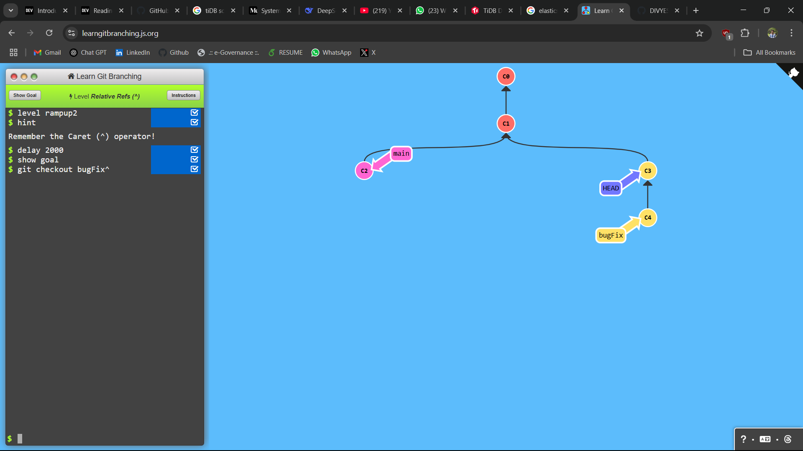
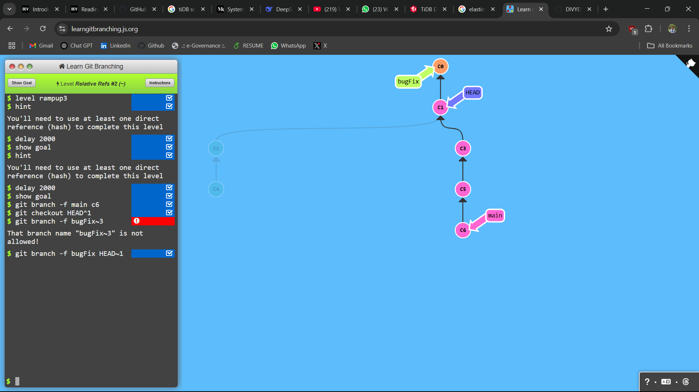
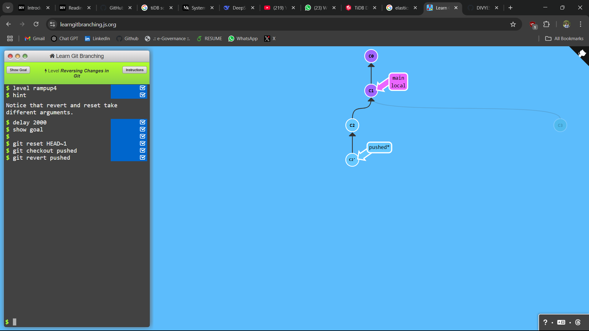

## LEVEL - 1: Detach yo' HEAD

### commands used

```
git checkout C4
```

### Screenshot


## LEVEL - 2: Relative Refs (^)

### commands used

```
git checkout bugFix^
```

### Screenshot



## LEVEL - 3: Relative Refs #2 (~)

### commands used

```
git branch -f main c6
git checkout HEAD^1
git branch -f bigFix HEAD~1
```

### Screenshot



## LEVEL - 4: Reversing Changes in Git

### commands used

```
git reset HEAD~1
git checkout pushed
git revert pushed
```

### Screenshot


