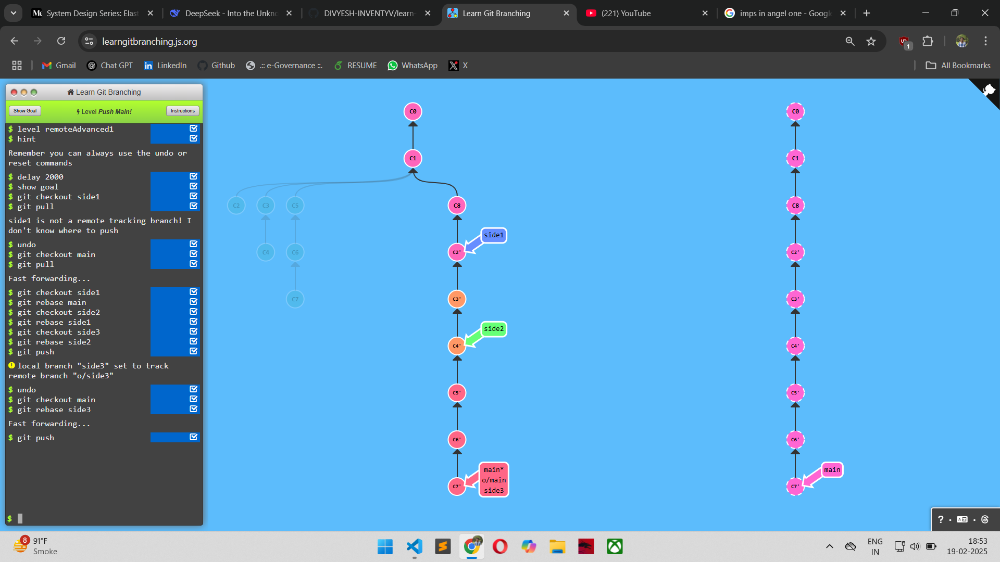
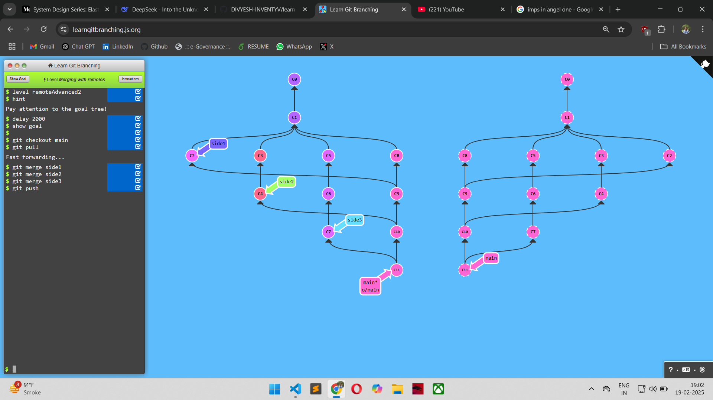
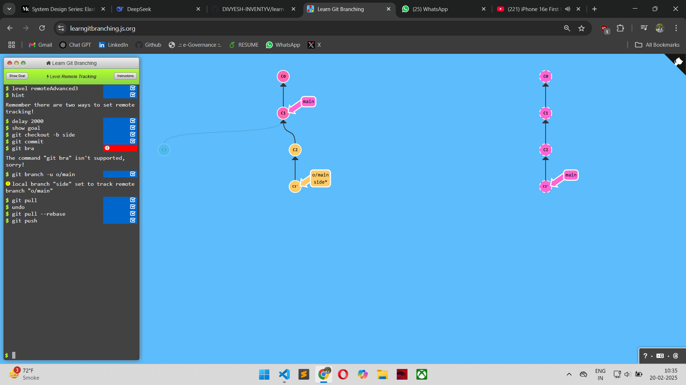
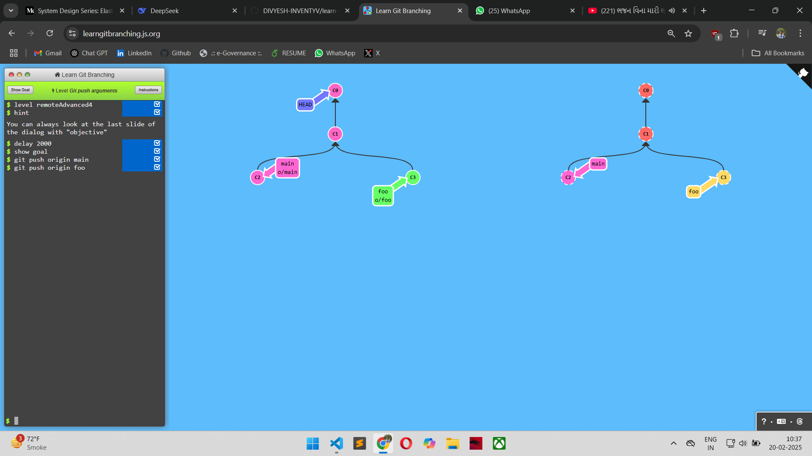
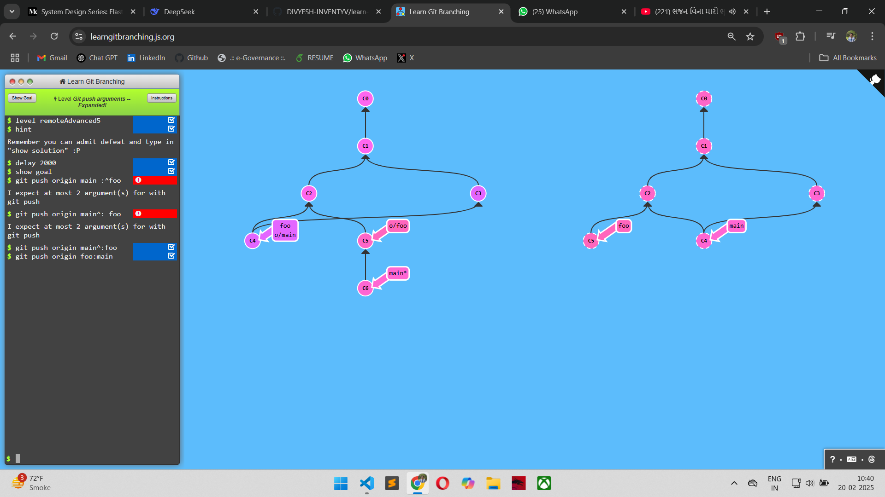
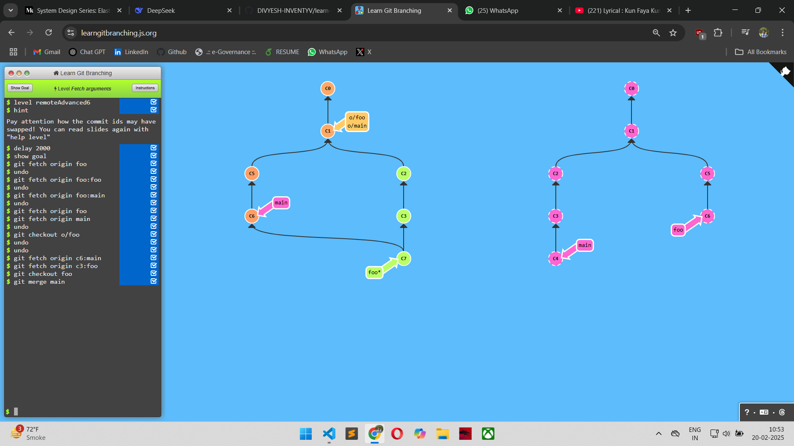
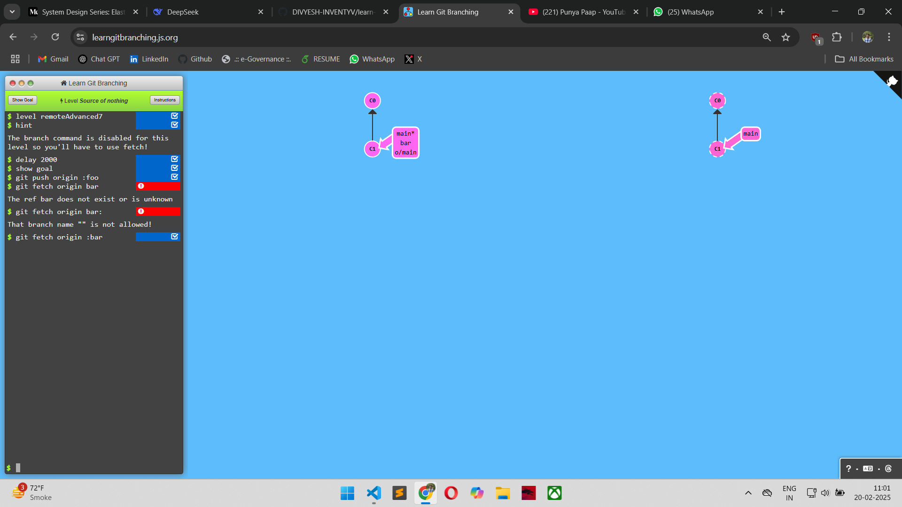
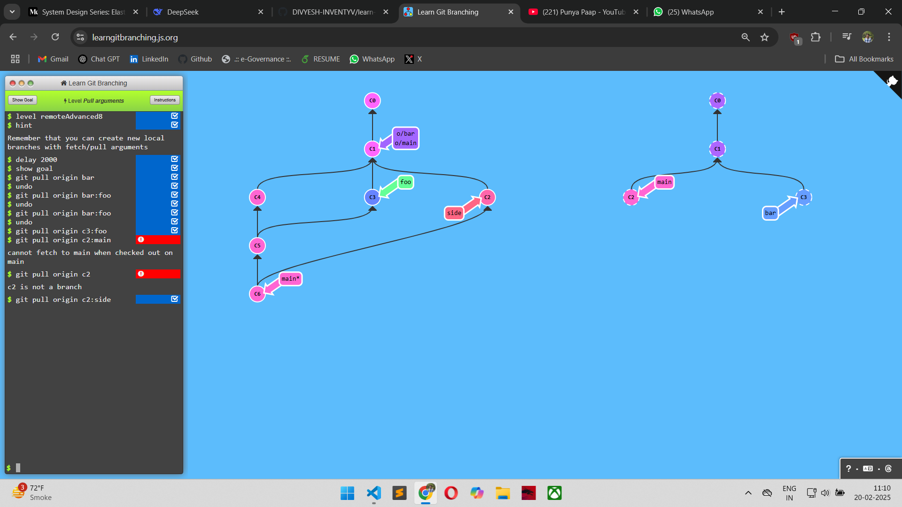

## LEVEL - 1: Push main

### commands used

```
git checkout side1
git checkout  main
git pull
git checkout side1
git rebase main
git checkout side2
git rebase side1
git checkout side3
git rebase side2
git checkout main
git rebase side3
git push
```

### Screenshot



## LEVEL - 2: Merging with remotes

### commands used

```
git checkout  main
git pull
git merge side1
git merge side2
git merge side3
git push
```

### Screenshot



## LEVEL - 3: Remote tracking

### commands used

```
git checkout -b side
git commit
git branch -u o/main
git pull --rebase
git push
```

### Screenshot



## LEVEL - 4: Git push arguments

### commands used

```
git push origin main
git push origin foo
```

### Screenshot



## LEVEL - 5: Git push arguments -- Expanded!

### commands used

```
git push origin main^:foo
git push origin foo:main
```

### Screenshot



## LEVEL - 6: Fetch arguments

### commands used

```
git fetch origin c6:main
git fetch origin c3:foo
git checkout foo
git merge main
```

### Screenshot



## LEVEL - 7: Source of nothing

### commands used

```
git push origin :foo
git fetch origin : bar
```

### Screenshot



## LEVEL - 8: Pull arguments

### commands used

```
git pull origin c2:main
git pull origin c2:side
```

### Screenshot


